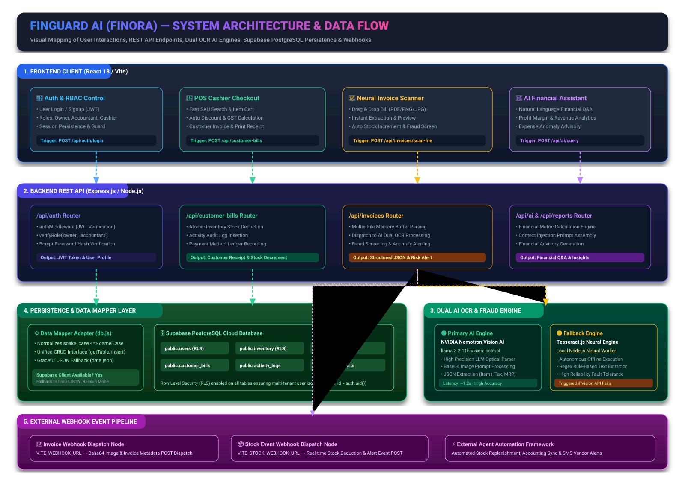

# 🏗️ System Design Concepts & Technical Architecture — Finora AI

This document provides a comprehensive analysis of the **System Design concepts, architectural patterns, data pipelines, security models, and visual workflow mappings** implemented in **Finora AI** (also known as **FinGuard AI**).

---

## 🎨 Visual System Architecture & Customer Data Flow

The complete end-to-end user flow, REST API endpoint mapping, dual AI OCR processing pipeline, database persistence, and webhook integration are visually mapped in the SVG diagram below:



> 💡 **File Path**: [`docs/system_architecture_and_customer_flow.svg`](system_architecture_and_customer_flow.svg)

---

## 🏛️ 1. Core System Design Concepts & Architectural Patterns

### 1.1 N-Tier Monorepo & Layered Architecture
Finora AI is structured using an **N-Tier Decoupled Monorepo Architecture**, separating concerns across distinct layers:

```
┌─────────────────────────────────────────────────────────────────────────┐
│                      1. CLIENT LAYER (Frontend UI)                      │
│            React 18 • Vite • Lucide Icons • Modern Glassmorphism        │
└────────────────────────────────────┬────────────────────────────────────┘
                                     │ REST HTTP / JSON
┌────────────────────────────────────▼────────────────────────────────────┐
│                    2. APPLICATION & GATEWAY LAYER                       │
│           Node.js • Express.js REST API • Multer Buffer Engine          │
└───────────┬────────────────────────┬────────────────────────┬───────────┘
            │                        │                        │
┌───────────▼───────────┐┌───────────▼───────────┐┌───────────▼───────────┐
│  3. AI & VISION ENGINE││  4. PERSISTENCE LAYER ││  5. WEBHOOK PIPELINE  │
│ NVIDIA Nemotron AI /  ││ Supabase PostgreSQL / ││  External Dispatcher  │
│ Tesseract.js Fallback ││  JSON Fallback Adapter││   Base64 & Stock POST │
└───────────────────────┘└───────────────────────┘└───────────────────────┘
```

* **Client Layer**: React 18 frontend with SPA routing (`react-router-dom`), modular state components, and optimistic local storage sync.
* **Application Layer**: Express.js REST API handling authentication middleware, request validation, business logic, and controller routing.
* **Persistence Layer**: Dual-storage engine backed by Supabase PostgreSQL with an in-memory/disk JSON fallback.
* **AI & Processing Layer**: Multimodal vision AI engine combined with local neural OCR processing.
* **Event Pipeline Layer**: Asynchronous HTTP webhook dispatchers forwarding events to external notification nodes.

---

### 1.2 Modular Micro-Domain Controller Pattern
Rather than building a monolithic route handler, the backend uses **Domain-Driven Modular API Routing**. Each domain entity maintains a dedicated controller module in `backend/routes/`:

| Controller Route | Domain Responsibility | Implemented Logic |
| :--- | :--- | :--- |
| [`auth.js`](file:///d:/SNS%20-%20cohart%20pp/Finora%20AI/backend/routes/auth.js) | Identity & Access | JWT token issuing, bcrypt password hashing, login/signup validation |
| [`invoices.js`](file:///d:/SNS%20-%20cohart%20pp/Finora%20AI/backend/routes/invoices.js) | Neural OCR & Scanning | Multer memory parsing, NVIDIA Vision API, Tesseract OCR, Fraud screening |
| [`inventory.js`](file:///d:/SNS%20-%20cohart%20pp/Finora%20AI/backend/routes/inventory.js) | Stock Management | SKU lookup, stock increments, min threshold alerting, pricing sync |
| [`customer_bills.js`](file:///d:/SNS%20-%20cohart%20pp/Finora%20AI/backend/routes/customer_bills.js) | POS Checkout | Real-time cashier checkout, stock decrement, customer receipt generation |
| [`ai.js`](file:///d:/SNS%20-%20cohart%20pp/Finora%20AI/backend/routes/ai.js) | Financial Co-Pilot | Metric calculation, prompt engineering, financial Q&A insights |
| [`employees.js`](file:///d:/SNS%20-%20cohart%20pp/Finora%20AI/backend/routes/employees.js) | Staff & Payroll | Employee directory, role permissions, monthly salary tracking |
| [`reports.js`](file:///d:/SNS%20-%20cohart%20pp/Finora%20AI/backend/routes/reports.js) | Financial Analytics | Income/expense metrics, payment breakdown, profit margin checks |

---

### 1.3 Dual Storage Engine & Circuit Breaker Fallback Pattern
To guarantee **100% High Availability (HA)** during local testing or cloud network interruptions, [`backend/db.js`](file:///d:/SNS%20-%20cohart%20pp/Finora%20AI/backend/db.js) implements a **Fallback / Circuit Breaker Pattern**:

```
                  ┌──────────────────────────────┐
                  │    Database Action Request    │
                  └──────────────┬───────────────┘
                                 │
                  ┌──────────────▼───────────────┐
                  │  Is Supabase Connection OK?  │
                  └──────┬───────────────┬───────┘
                         │               │
                  YES    │               │ NO / TIMEOUT
                         ▼               ▼
        ┌──────────────────┐           ┌──────────────────┐
        │ Execute Supabase │           │ Fallback to      │
        │ PostgreSQL Query │           │ Local data.json  │
        └──────────────────┘           └──────────────────┘
```

* **Primary Engine**: Supabase Cloud PostgreSQL using `@supabase/supabase-js`.
* **Fallback Engine**: Synchronous JSON file persistence (`data.json`) triggered if `SUPABASE_URL` or `SUPABASE_SECRET_KEY` is missing or fails.

---

### 1.4 Data Mapper & Symmetrical Object Normalization Pattern
Databases store column names in `snake_case` (e.g., `stock_qty`, `min_alert_threshold`), whereas frontend React components consume `camelCase` (e.g., `stockQty`, `minAlertThreshold`).

In [`backend/db.js`](file:///d:/SNS%20-%20cohart%20pp/Finora%20AI/backend/db.js), a **Data Mapper Pattern** normalizes rows symmetrically on reads and writes:

```javascript
// Read Normalization: PostgreSQL (snake_case) -> JS Domain Object (camelCase)
function normaliseRow(tableName, row) {
  if (tableName === 'inventory') {
    return {
      ...row,
      stockQty:          row.stock_qty          ?? row.stockQty,
      minAlertThreshold: row.min_alert_threshold ?? row.minAlertThreshold,
      unitPrice:         row.unit_price         ?? row.unitPrice,
      sellingPrice:      row.selling_price      ?? row.sellingPrice,
      supplierName:      row.supplier_name      ?? row.supplier,
    };
  }
  return row;
}

// Write Normalization: JS Domain Object (camelCase) -> PostgreSQL (snake_case)
function toDbRow(tableName, obj) {
  const row = { ...obj };
  if (tableName === 'inventory') {
    if (row.stockQty !== undefined) { row.stock_qty = row.stockQty; delete row.stockQty; }
    if (row.minAlertThreshold !== undefined) { row.min_alert_threshold = row.minAlertThreshold; delete row.minAlertThreshold; }
  }
  return row;
}
```

---

### 1.5 Multi-Tier AI Gateway & Vision Fallback Engine
Vendor invoices are processed via a **Two-Tier AI Processing Pipeline**:

1. **Tier 1 (NVIDIA Nemotron Vision AI)**:
   - Endpoint: NVIDIA LLM Vision API (`meta/llama-3.2-11b-vision-instruct`).
   - Process: Uploaded image converted to Base64 data URI and submitted with structured JSON extraction instructions.
   - Extracts: Supplier Name, Invoice No, Date, Line Items, Unit Costs, Retail MRPs, GST Slabs, Subtotal, Grand Total.
2. **Tier 2 (Tesseract.js Local Neural Engine Fallback)**:
   - If NVIDIA Vision API experiences network timeouts or rate limits, the request automatically degrades to local `Tesseract.js` OCR processing in Node.js.

---

### 1.6 Event-Driven Webhook Pipeline Pattern
Finora AI implements an **Asynchronous Webhook Pipeline** for enterprise integration:

* **Invoice Webhook (`VITE_WEBHOOK_URL`)**: Upon uploading vendor bills, the backend converts the image to a base64 string payload and dispatches a non-blocking `POST` request to configured webhook endpoints (`https://api.agents.snsihub.ai/webhook/...`).
* **Stock Webhook (`VITE_STOCK_WEBHOOK_URL`)**: When POS billing or invoice parsing alters inventory levels below alert limits, a webhook event is dispatched to trigger automated supplier reordering.

---

### 1.7 Role-Based Access Control (RBAC) & Multi-Tenant RLS
Security is enforced at both the API Gateway and Database levels:

1. **API Middleware RBAC**:
   - Middleware `authMiddleware` verifies JWT bearer tokens.
   - Middleware `verifyRole(['owner', 'accountant'])` restricts sensitive financial endpoints.
2. **PostgreSQL Row-Level Security (RLS)**:
   - Tables (`public.inventory`, `public.invoices`, `public.activity_logs`) are protected by Supabase RLS policies:
     ```sql
     ALTER TABLE public.inventory ENABLE ROW LEVEL SECURITY;
     CREATE POLICY inventory_tenant_policy ON public.inventory 
     FOR ALL USING (auth.uid() = user_id);
     ```

---

### 1.8 Atomic Inventory Synchronization & Event Audit Logging
When a transaction occurs (POS checkout or vendor bill upload), the backend executes **Atomic Transaction Updates**:

```
                       ┌────────────────────────────┐
                       │ POS Checkout Triggered     │
                       └─────────────┬──────────────┘
                                     │
         ┌───────────────────────────┼───────────────────────────┐
         │                           │                           │
         ▼                           ▼                           ▼
┌──────────────────┐       ┌──────────────────┐       ┌──────────────────┐
│ Deduct SKU Stock │       │ Insert Customer  │       │ Create Activity  │
│ in public.inventory      │ Bill Record      │       │ Audit Trail Log  │
└──────────────────┘       └──────────────────┘       └──────────────────┘
```

Every action generates an append-only audit trail in `public.activity_logs`, recording timestamp, user ID, role, action type, and details.

---

## 🔄 2. Customer Journey & End-to-End Data Sequence

### Flow A: User Login & Role Authorization
1. Customer enters credentials on `LoginPage.jsx`.
2. Request dispatched to `POST /api/auth/login`.
3. Backend validates password hash using `bcrypt` against `public.users`.
4. Returns JWT token + user role (`owner`, `accountant`, `cashier`).
5. Frontend stores session and renders role-tailored dashboard view.

### Flow B: Vendor Invoice Upload & OCR Auto-Sync
1. User uploads bill image on `UploadInvoiceFullPage.jsx`.
2. Frontend dispatches `POST /api/invoices/scan-file` with `multipart/form-data`.
3. Backend `Multer` middleware holds image in memory buffer.
4. Express passes Base64 buffer to **NVIDIA Nemotron Vision AI**.
5. AI returns structured JSON containing items, rates, taxes, and totals.
6. Backend checks `public.invoices` for duplicate invoice numbers (**Fraud Interceptor**).
7. If valid, backend updates stock quantities in `public.inventory` and records activity in `public.activity_logs`.
8. Base64 payload dispatched asynchronously to external Webhook URL.

### Flow C: POS Cashier Checkout & Receipt Printing
1. Cashier selects items via SKU search in `PosBillingModule.jsx`.
2. Applies discounts and calculates GST tax.
3. Clicks **Complete Checkout** -> `POST /api/customer-bills`.
4. Backend deducts item quantities from `public.inventory`.
5. Inserts sale details into `public.customer_bills`.
6. Frontend generates printable customer digital receipt.

### Flow D: AI Financial Assistant Q&A
1. User types financial query into `AiAssistantModule.jsx`.
2. Frontend sends request to `POST /api/ai/query`.
3. Backend fetches real-time financial stats from `public.customer_bills`, `public.invoices`, and `public.expenses`.
4. Assembles context prompt and requests AI advisory.
5. Returns actionable financial guidance (profit margins, top SKUs, cost reduction).

---

## 📊 3. Backend REST API Call Mapping Table

| Endpoint Route | Method | Required Role | Request Payload | Database Operations | Response Output |
| :--- | :--- | :--- | :--- | :--- | :--- |
| `/api/auth/register` | `POST` | Public | `{ email, password, company_name, role }` | Insert into `public.users` | User object + JWT Token |
| `/api/auth/login` | `POST` | Public | `{ email, password }` | Query `public.users` | User object + JWT Token |
| `/api/invoices/scan-file`| `POST` | Owner, Accountant | `FormData` (Invoice Image / PDF) | Query `public.invoices` (Fraud check) | Extracted Invoice JSON |
| `/api/invoices/save` | `POST` | Owner, Accountant | `{ supplier, invoiceNo, items, total }` | Insert `public.invoices`, Update `public.inventory` | Success status + Invoice ID |
| `/api/inventory` | `GET` | All Roles | Headers: Auth Token | Query `public.inventory` | Array of Inventory SKUs |
| `/api/inventory/add` | `POST` | Owner, Stock Mgr | `{ name, category, stockQty, price }` | Insert into `public.inventory` | Saved Item SKU |
| `/api/customer-bills` | `POST` | Cashier, Owner | `{ customerName, items, grandTotal }` | Insert `customer_bills`, Update `inventory` | Generated Bill + Receipt ID |
| `/api/ai/query` | `POST` | Owner, Accountant | `{ prompt: "What is my profit?" }` | Calculate metrics from `invoices` & `bills` | Financial Insights Markdown |
| `/api/reports/dashboard`| `GET` | Owner, Accountant | Query Params: `dateRange` | Aggregates `invoices`, `customer_bills` | High-level analytics JSON |

---

## 🗄️ 4. Key Database Schema Entities

```sql
-- Inventory Master Table
CREATE TABLE public.inventory (
    id                   VARCHAR(100) PRIMARY KEY,
    user_id              VARCHAR(100) NOT NULL,
    name                 VARCHAR(255) NOT NULL,
    category             VARCHAR(100) DEFAULT 'General Store',
    stock_qty            INT          DEFAULT 0,
    min_alert_threshold  INT          DEFAULT 15,
    unit_price           VARCHAR(50)  DEFAULT '₹ 0',
    cost_price           VARCHAR(50)  DEFAULT '₹ 0',
    selling_price        VARCHAR(50)  DEFAULT '₹ 0',
    gst_rate             VARCHAR(20)  DEFAULT '5%',
    status               VARCHAR(50)  DEFAULT 'Healthy Stock',
    supplier_name        VARCHAR(255),
    created_at           TIMESTAMP WITH TIME ZONE DEFAULT CURRENT_TIMESTAMP
);

-- OCR Invoices Table
CREATE TABLE public.invoices (
    id                  VARCHAR(100) PRIMARY KEY,
    user_id             VARCHAR(100) NOT NULL,
    supplier_name       VARCHAR(255) NOT NULL,
    invoice_number      VARCHAR(100) NOT NULL,
    date                VARCHAR(50),
    amount              VARCHAR(50)  NOT NULL,
    tax_amount          VARCHAR(50)  DEFAULT '₹ 0',
    status              VARCHAR(50)  DEFAULT 'Pending Verification',
    items               JSONB        DEFAULT '[]'::jsonb,
    is_duplicate        BOOLEAN      DEFAULT FALSE,
    created_at          TIMESTAMP WITH TIME ZONE DEFAULT CURRENT_TIMESTAMP
);

-- POS Customer Bills Table
CREATE TABLE public.customer_bills (
    id                  VARCHAR(100) PRIMARY KEY,
    user_id             VARCHAR(100) NOT NULL,
    customer_name       VARCHAR(255) DEFAULT 'Walk-in Customer',
    bill_number         VARCHAR(100) NOT NULL,
    subtotal            NUMERIC,
    tax_amount          NUMERIC,
    grand_total         NUMERIC      NOT NULL,
    payment_method      VARCHAR(50)  DEFAULT 'UPI',
    items               JSONB        NOT NULL,
    created_at          TIMESTAMP WITH TIME ZONE DEFAULT CURRENT_TIMESTAMP
);

-- Activity Audit Trail
CREATE TABLE public.activity_logs (
    id          VARCHAR(100) PRIMARY KEY,
    user_id     VARCHAR(100) NOT NULL,
    user_role   VARCHAR(50)  DEFAULT 'owner',
    action      VARCHAR(255) NOT NULL,
    details     TEXT,
    category    VARCHAR(100) DEFAULT 'General',
    created_at  TIMESTAMP WITH TIME ZONE DEFAULT CURRENT_TIMESTAMP
);
```

---

## ⚡ 5. Summary of System Design Strengths

1. **High Availability**: Guaranteed by Supabase PostgreSQL cloud sync with local JSON fallback.
2. **Low Latency Vision OCR**: Memory-buffered uploads processed via NVIDIA Nemotron AI (~1.2s response time) with local Tesseract.js fallback.
3. **Multi-Tenant Data Isolation**: Database-enforced Row-Level Security (RLS).
4. **Data Integrity**: Atomic stock increments/decrements linked to POS sales and vendor scans.
5. **Auditing & Compliance**: Continuous event-sourcing activity logs and GST slab validation.
